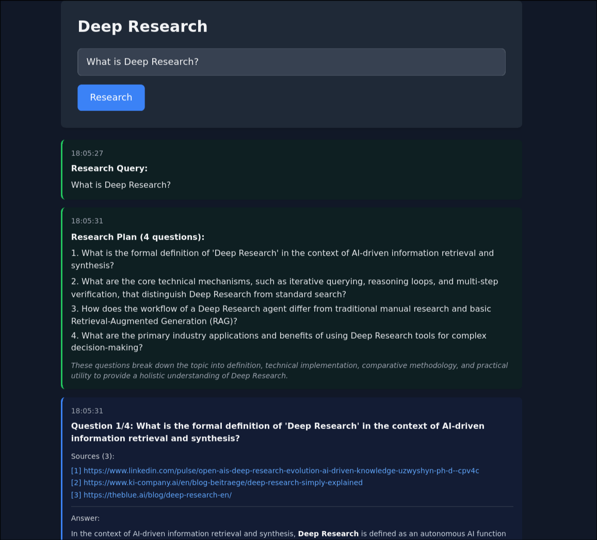

# Deep Research

A production-ready multi-agent AI research system that decomposes complex queries, conducts parallel research, and synthesizes comprehensive answers with cited sources.

**Live Demo:** [https://deepresearch.joehirst.dev](https://deepresearch.joehirst.dev)



## Features

- **Multi-Agent Architecture** - Coordinated AI agents (Planner, Researcher, Synthesizer) work together to tackle complex research tasks
- **Deep Research** - Automatically decomposes queries into focused sub-questions for thorough investigation
- **Real-Time Streaming** - Server-Sent Events (SSE) stream progress updates as research happens
- **Source Citations** - Tracks and provides all research sources for verification
- **Structured Logging** - JSON logs with request tracing for production monitoring
- **Comprehensive Tests** - Unit and integration tests with 100% agent coverage
- **Production Deployment** - Live on Google Cloud Run, deployed with Terraform and Docker

## Architecture

### Multi-Agent Research Flow

```
User Query
    ↓
┌──────────────────┐
│  Planner Agent   │  Decomposes query into 2-5 focused sub-questions
└──────────────────┘
    ↓
┌──────────────────┐
│ Researcher Agent │  Researches each sub-question with web search + LLM
└──────────────────┘  (Processes all sub-questions)
    ↓
┌──────────────────┐
│ Synthesizer Agent│  Combines findings into comprehensive final answer
└──────────────────┘
    ↓
Final Answer + All Sources
```

### Agent Responsibilities

- **Planner** - Analyses queries and decomposes them into logical sub-questions
- **Researcher** - Executes web searches (Tavily API) and synthesizes findings with LLM
- **Synthesizer** - Combines all answers into a comprehensive final response
- **Web Search** - Tavily API integration with retry logic and structured results

## Tech Stack

- **FastAPI** - Modern async web framework with SSE support
- **OpenAI SDK** - LLM integration (compatible with any OpenAI-compatible provider; live version uses Gemini Flash for optimal performance/cost balance)
- **Tavily AI** - Web search API optimised for AI applications
- **Frontend** - Vanilla JavaScript with Tailwind CSS for the interactive demo
- **Docker** - Containerisation for deployment
- **Google Cloud Run** - Serverless container hosting
- **Terraform** - Infrastructure as code for deployment
- **Python 3.13+** - Modern async/await patterns

## Prerequisites

- Python 3.13 or higher
- API Keys:
  - OpenAI API-compatible provider (I'm using [Gemini](https://ai.google.dev/gemini-api/docs/openai) - free tier available)
  - [Tavily API Key](https://tavily.com/) (1000 free searches/month)

## Quick Start

### 1. Clone and Install

```bash
git clone <your-repo-url>
cd deep-research
uv sync
```

### 2. Configure Environment

Create a `.env` file:

```env
# LLM Configuration
LLM_API_KEY=your_gemini_api_key_here
LLM_BASE_URL=https://generativelanguage.googleapis.com/v1beta/openai/
LLM_MODEL=gemini-3-flash-preview

# Search API
TAVILY_API_KEY=your_tavily_api_key_here

# Authentication (demo only - We would use OAuth for production instead of Basic Auth)
BASIC_AUTH_USERNAME=admin
BASIC_AUTH_PASSWORD=your_secure_password_here
```

### 3. Run the Server

```bash
fastapi dev src/main.py
```

Server starts at: http://localhost:8000

### 4. Try the Demo

Open http://localhost:8000 in your browser to use the interactive demo interface.

## API Documentation

Interactive API documentation (Swagger): [https://deepresearch.joehirst.dev/docs](https://deepresearch.joehirst.dev/docs)

### Authentication

All endpoints (except `/`) require HTTP Basic Authentication. **Note:** Basic Auth is for demo purposes only - production deployments should use OAuth or similar secure authentication.

```bash
curl -u admin:password http://localhost:8000/login
```

### Endpoints

#### `GET /`
Serves the interactive demo interface.

#### `POST /login`
Verifies credentials and returns success message.

**Request:**
```bash
curl -u admin:password -X POST http://localhost:8000/login
```

**Response:**
```json
{
  "message": "Login successful",
  "username": "admin"
}
```

#### `POST /research/stream`
Primary research endpoint with real-time streaming updates.

**Request:**
```bash
curl -u admin:password -N -X POST http://localhost:8000/research/stream \
  -H "Content-Type: application/json" \
  -d '{"query": "How does retrieval-augmented generation improve LLM accuracy?"}'
```

**SSE Event Stream:**

The endpoint streams JSON events in real-time:
- `progress` - Status updates during processing
- `plan` - Research plan with sub-questions and reasoning
- `question` - Each sub-question being researched
- `sources` - Sources found for the current sub-question
- `answer` - Answer to the current sub-question
- `all_sources` - All unique sources used
- `final` - Synthesized final answer
- `complete` - Research completed
- `error` - Error occurred

## Logging

Structured JSON logging optimised for cloud environments. Each request is traced with a unique ID, and logs include metadata (counts, lengths, indices) without sensitive data. All queries and answers are excluded for privacy and security.

## Deployment

The live application is deployed to **Google Cloud Run** using **Terraform**. The configuration in `terraform/` defines the Cloud Run service, environment variables, secrets management, and networking.

```bash
# Deploy with Terraform
cd terraform
terraform init
terraform plan
terraform apply
```

For local testing:

```bash
docker build -t deep-research .
docker run -p 8000:8000 \
  -e LLM_API_KEY=your_key \
  -e TAVILY_API_KEY=your_key \
  deep-research
```

## Development

The project includes comprehensive test coverage with unit tests for each agent (Planner, Researcher, Synthesizer, Search) and integration tests for the API endpoints, authentication, and streaming flow.

Code quality is maintained with ruff for linting/formatting and basedpyright for type checking. All checks run via pre-commit hooks.

```bash
pytest                           # Run tests
ruff check                       # Lint
ruff format                      # Format
basedpyright                     # Type check
```

## Design Decisions

**Multi-Agent Architecture**: Breaking research into specialised agents (Planner, Researcher, Synthesizer) provides modularity, independent testability, and clear separation of concerns. Each agent can be enhanced or replaced independently.

**OpenAI SDK**: Using the OpenAI SDK with an OpenAI-compatible endpoint allows easy switching between providers. The live deployment uses Gemini Flash for its optimal balance of speed (< 2s per call) and cost-effectiveness.

**Tavily Search**: Purpose-built for AI agents with structured responses, content snippets, and generous free tier (1000 searches/month). Superior to generic search APIs for LLM consumption.

**Streaming (SSE)**: Multi-agent research takes 10-30 seconds total. Real-time streaming provides progress feedback, improves perceived performance, and enables early cancellation.

## License

MIT License - see LICENSE file for details
